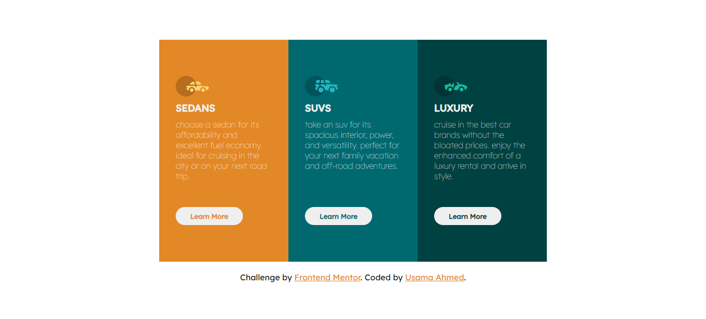

# Frontend Mentor - 3-column preview card component solution

This is a solution to the [3-column preview card component challenge on Frontend Mentor](https://www.frontendmentor.io/challenges/3column-preview-card-component-pH92eAR2-). Frontend Mentor challenges help you improve your coding skills by building realistic projects.

## Table of contents

- [Overview](#overview)
  - [Screenshot](#screenshot)
  - [Links](#links)
  - [Built with](#built-with)
  - [Author](#author)

## Overview

### Screenshot

<h2 style="text-align:center;"> Desktop View</h2>

<h2 style="text-align:center;"> Mobile View</h2>

### Links

[Solution URL](https://github.com/UsamaBinKashif/statuspreviewcard)
 
[Live Site URL](https://usamabinkashif.github.io/statspreview-card.github.io/)

### Built with

- HTML5
- CSS3
- Flexbox

## Author

- Website - [Usama Bin Kashif](https://github.com/UsamaBinKashif)
- Frontend Mentor - [@usamabinkashif](https://www.frontendmentor.io/profile/UsamaBinKashif)
- Twitter - [@usamabinkashif](https://twitter.com/UsamaBinKashif)
